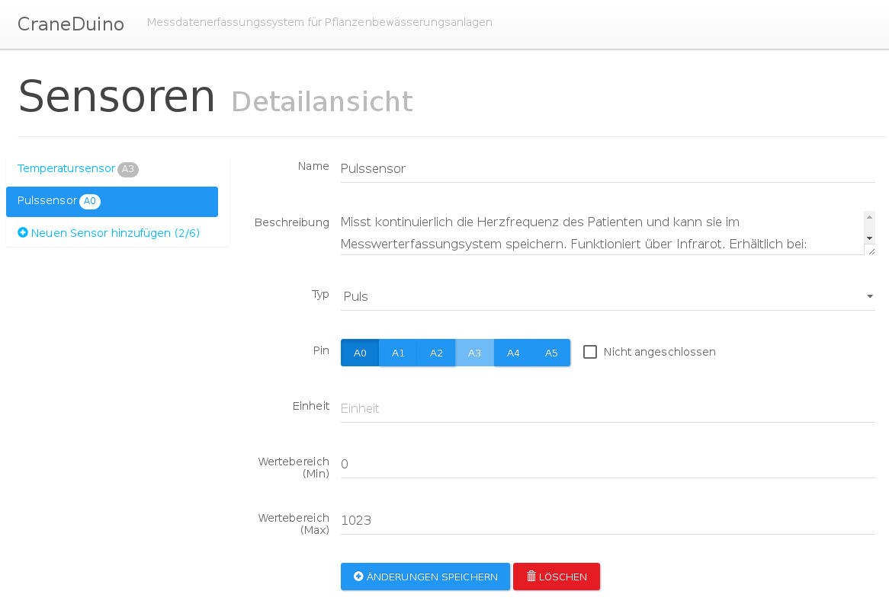

# craneduino
craneduino is a lightweight web application that is designed to run time consuming series of measurements. The app helps to visualize the data with charts and to manage measurements and sensors. It is designed to run on a Raspberry Pi with an Arduino connection.

## Major dependencies

### Server
- [Arduino](http://www.arduino.cc) Microcontroller to generate data
- [NodeJS](https://nodejs.org) Server-Side-Javascript platform
- [Express](http://expressjs.com) - NodeJS library to create the REST api
- [Johnny Five](https://github.com/rwaldron/johnny-five/) - NodeJS library to communicate with the Arduino

### Client
- [AngularJS](https://angularjs.org) Javascript framework for dynamic web applications
- [Flot](http://flotcharts.org) - Library to visualize data with any kind of plot or chart
